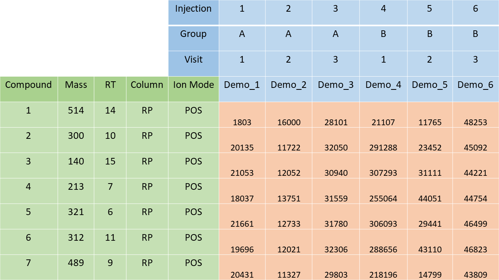

```{r setup, include = FALSE}
knitr::opts_chunk$set(
  collapse = TRUE,
  warning = FALSE,
  message = FALSE,
  results = FALSE,
  comment = "##"
)
```

In this project example, core functionality of ```notame``` is demonstrated in unison with the associated protocol article [@notame]. Since substantive insight is not a focus of the project example, results visualizations are omitted.

# Project setup

## Attach library

Attach ```notame```.

```{r}
library(notame)
```

## Set up path and logging

Let's set up a path and start logging our project. Many functions of the package will log information when they have finished. This helps in monitoring the analysis process in case something goes wrong and in reviewing the results later. The log will also print to console, although we'll exclude console output for the rest of the document for brevity.

```{r, results = 'markup'}
ppath <- tempdir()
init_log(log_file = file.path(ppath, "log.txt"))
```

## Read data

Now we can read in the actual data! The data is from a project with samples from three different groups. The data is scrambled; the feature information does not correspond to the abundances given. The function ```read_from_excel``` reads data from an Excel spreadsheet using the following format:  

```{r, out.width = "600px", echo=FALSE}

```

There are a few obligatory fields, including "Injection_order" in sample information, "Mass" or "Average mz" in feature data and "Retention time", "RetentionTime", "Average rt(min)" or "rt" in feature information (not case sensitive). There are further optional fields, including "Sample_ID" and "QC" in sample data as well as "Feature_ID" in feature data, which are automatically generated if unavailable. One or more fields in feature data can be used to split the data into parts, usually LC column x ionization mode, supplied as arguments to the ```split_by``` parameter. If the file only contains one mode, specify the name of the mode, e.g. "HILIC_pos" to the ```name``` parameter. Please see documentation for more information.


```{r}
data <- read_from_excel(
  file = system.file("extdata", "sample_data_whole.xlsx", package = "notame"), sheet = 1, corner_row = 4, corner_column = "X", 
  split_by = c("Column", "Ion mode"))
```


The function ```read_from_excel``` returns a list holding the three parts of the data:

- ```exprs```: feature abundances across the samples  
- ```pheno_data```: sample information  
- ```feature_data```: feature information

```{r, results = 'markup'}
names(data)
sapply(data, class)
sapply(data, dim)
```

## Construct MetaboSet objects

These three parts can be used to construct MetaboSet objects using the  ```construct_metabosets``` function. The function parameters are the three parts of a dataset, plus special column names: ```group_col```, ```time_col``` and ```subject_col``` which can be stored in the instance for convenience as many functions use the columns as default values.

```{r}
modes <- construct_metabosets(
  exprs = data$exprs, pheno_data = data$pheno_data, 
  feature_data = data$feature_data, group_col = "Group")
```

The function returns a list of MetaboSet objects, one per mode (LC column x ionization mode) or whatever split was supplied to ```read_from_excel```.

```{r, results = 'markup'}
names(modes)
sapply(modes, class)
```

# Data pretreatment

## Data pretreatment by mode

Data pretreatment is performed to complete the dataset by way of reducing unwanted variation and data preparation dependent on downstream methods. Steps performed separately for each mode include marking missing values as NA, flagging features with low detection [@qcguidelines] rate, drift correction [@driftcorrection], and flagging of low-quality features [@qcguidelines]. Visualizations are drawn to monitor the data pretreatment process and explore the data globally. The ```visualizations``` wrapper does not include feature-wise plots as it may not be feasible to inspect them at this stage of the analysis. For example, drift correction visualizations are perhaps best drawn for a subset of interesting features after feature selection.


```{r}
# Initialize empty list for processed objects
processed <- list()
for (i in seq_along(modes)) {
  name <- names(modes)[i]
  mode <- modes[[i]]
  # Set all zero abundances to NA
  mode <- mark_nas(mode, value = 0)
  # Flag features with low detection rate
  mode <- flag_detection(mode, qc_limit = 0.7, group_limit = 0.8)
  # Visualize data before drift correction
  visualizations(mode, prefix = paste0(ppath, "figures/", name, "_ORIG"))
  # Correct Drift
  corrected <- correct_drift(mode)
  # Visualize data after drift correction
  visualizations(corrected, prefix = paste0(ppath, "figures/", name, "_DRIFT"))
  # Flag low-quality features
  corrected <- corrected %>% assess_quality() %>% flag_quality()
  # Visualize data after removal of low-quality features
  visualizations(corrected, prefix = paste0(ppath, "figures/", name, "_CLEANED"))
  # Save result of iteration
  processed[[i]] <- corrected
}
```

Feature-wise flagging information, quality metrics, and brief drift correction notes are included in the feature information after the above steps. ```correct_drift``` performs drift correction on all features with sufficient detection in QC samples by default. In case ```check_quality = TRUE```, ```correct_drift``` retains corrected values only for features with improved quality metrics after drift correction, along with a note documenting this action in feature information. 

```{r, results = 'markup'}
fData(processed[[1]])$DC_note
```

## Data pretreatment for the complete dataset

Next, it is time to merge the modes together and visualize the complete dataset.
```{r}
merged <- merge_metabosets(processed)
visualizations(merged, prefix = paste0(ppath, "figures/_FULL"))
```

Then, QC samples can (and should) be removed, as they are no longer needed, and the dataset is visualized anew.

```{r}
merged_no_qc <- drop_qcs(merged)
visualizations(merged_no_qc, prefix = paste0(ppath, "figures/FULL_NO_QC"))
```

If there are any missing values in the data, they need to be imputed. Let's use random forest imputation to impute these values and visualize the dataset one last time before statistical analysis. Seed number should be set before random forest imputation to guarantee reproducibility of results.

```{r}
# Set seed number for reproducibility
set.seed(38)
imputed <- impute_rf(merged_no_qc)
visualizations(imputed, prefix = paste0(ppath, "figures/FULL_IMPUTED"))
```

By default, the imputation procedure only operates on good quality features, i.e. those that have not been flagged. To use flagged features in statistical analysis, they should be imputed as well. This can be achieved through a second round of imputation, now with all features included. This two-step imputation makes sure that low-quality features don't affect the imputation of quality features. Imputation could also be performed separately for each mode to reduce execution time, especially if the amounts of features still allows for good imputation results.

```{r}
base <- impute_rf(imputed, all_features = TRUE)
```

It is a good idea to save the merged and processed data, so experimenting with different statistical analyses becomes easier.

```{r}
save(base, file = paste0(ppath, "full_data.RData"))
```

Now we are ready for statistical analysis!

# Feature selection

## Univariate analysis

Let's try to find features that separate the study groups. First, we'll use Welch's analysis of variance to evaluate the features in terms of the probability of obtaining the observed abundances given the null hypothesis, namely that there is no difference in feature abundance across study groups.

```{r}
anova_results <- perform_oneway_anova(base, formula_char = "Feature ~ Group")
```

Now we have an idea of which features are more or less likely to display a true difference in feature levels (judged by p-value) across the three study groups. Next, we will conduct pairwise Welch's t-tests to find out between which groups these interesting features differ in abundance.

```{r}
top_features <- anova_results$Feature_ID[which(anova_results$ANOVA_P_FDR < 0.2)]

top_index <- fData(base)$Feature_ID %in% top_features

pairwise_results <- perform_pairwise_t_test(base[top_index, ], group = "Group")
```

The next step is to join the results from Welch's one-way analysis of variance and post-hoc t-tests and add the results to the instance.

```{r}
combined_results <- dplyr::left_join(anova_results, pairwise_results)
base <- join_fData(base, combined_results)
```

## Supervised learning

Univariate hypothesis testing does not take into account the multivariate, interconnected nature of the data. Parametric tests as the one above also make assumptions about the data which may undermine the reliability of the results, as they are likely to be violated in untargeted LC-MS datasets. Let's use supervised learning to see which features best predict group membership to get another perspective. A random forest model doesn't require further data pretreatment and makes minimal assumptions.


```{r}
rf_results <- fit_rf(imputed, y = "Group")

rf_importance <- importance_rf(rf_results)

base <- join_fData(imputed, rf_importance[, c("Feature_ID", "MeanDecreaseAccuracy")])
```

Next, univariate and supervised rankings of features could be combined in a final ranking. Such a final ranking would combine the qualities of univariate analysis and supervised learning. The final results are more practical than inferential; it helps in limiting the number of features undergoing labour-intensive scrutiny for biological meaning, for example by identification and pathway analysis. This may ultimately guide further efforts in productive directions. For example, in biomarker discovery, the results may prompt validation using targeted LC-MS.

That concludes our project example. The last thing to do is to write the results to an excel file and finish the logging. Thanks!

```{r}
write_to_excel(base, file = paste0(ppath, "results.xlsx"))
finish_log()
```

# Session information

```{r, echo = FALSE, results = 'markup'}
sessionInfo()
```

# References
